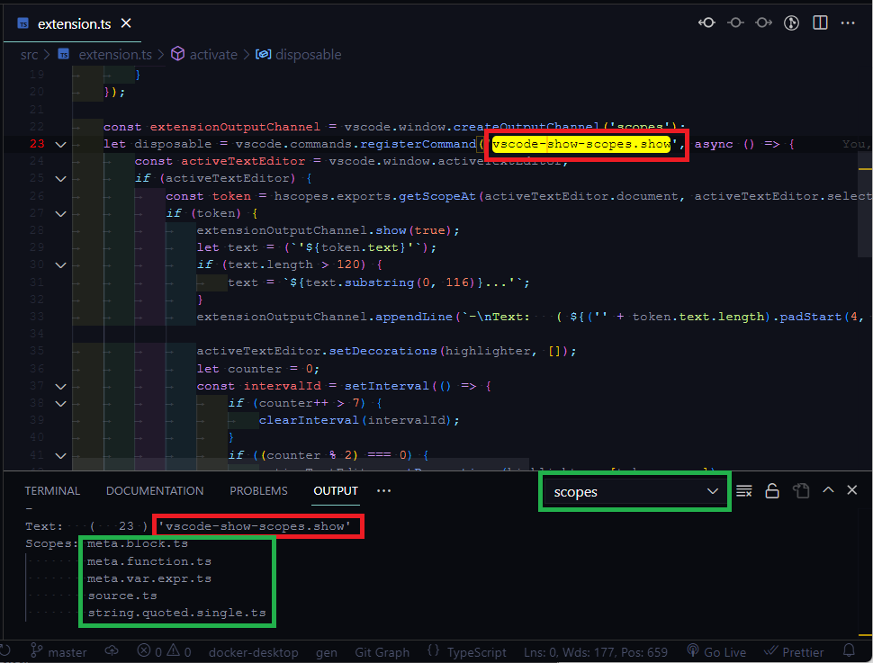

# vscode-show-scope README

Show scopes at cursor in active editor in output channel 'scopes'. Ofcourse there is a built-in command ```editor.action.inspectTMScopes``` which shows scopes at cursor in active editor in a popup window (use escape to hide the popup). However, this information cannot be accesed programatically. This extension shows how to use the API exposed by the VSCode extension  ```draivin.hscopes```.

```
const hscopes: any = vscode.extensions.getExtension('draivin.hscopes');
.
.
.
const token = hscopes.exports.getScopeAt(activeTextEditor.document, activeTextEditor.selection.active);

if (token) {
    // Dump the token which has text, range and scopes srray
    console.log(JSON.stingify(token, null, ' '));
}
```

The returned token looks like this:

```json
{
  "range": [
    {
      "line": 2,
      "character": 25
    },
    {
      "line": 2,
      "character": 31
    }
  ],
  "text": "vscode",
  "scopes": [
    "source.ts",
    "meta.import.ts",
    "string.quoted.single.ts"
  ]
}
```

## Features

Show scopes at cursor in active editor in output channel 'scopes'. The matching text range is momentarily highlighted in yellow background.

- ```ctrl+shift+/``` is bound to ```Show scopes``` command.




- ```ctrl+shift+alt+/``` is bound to ```Developer: Inspect Editor Tokens and Scopes``` command.
## Requirements

Depends on extension ```draivin.hscopes```
## Extension Settings

## Known Issues

## Release Notes

### 1.0.14

Initial release
